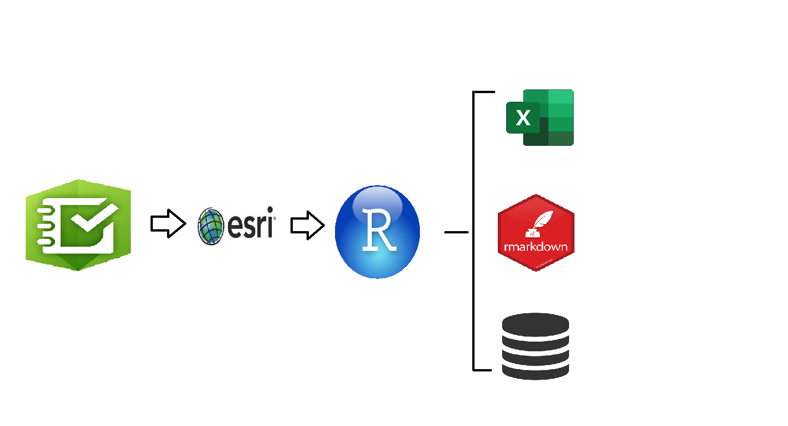
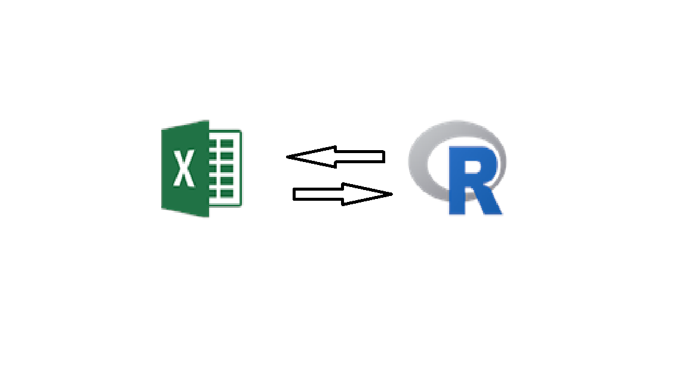
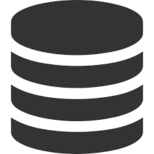

```{r Packages Used, include=FALSE}
# Packages Used
library(knitr)
library(webshot)
library(DT)
library(readxl)
library(openxlsx)
library(excelR)
library(tidyverse)
library(sf)
```

### 1. Introduction

$~$

This document was inspired from sitting in a ton of meetings with the federal and state natural resource agencies, and noticing that their is a big issue with how agencies manage the data they receive from consultant companies and licensee holders. From those out of the loop and coming across this document, most natural resource agencies don't typically go out and do all the surveying for threatened, endangered, or special interest species, but provide opportunity for biological consultants, academics, and different agency biologists to go out and perform surveys under direction and with license/permit from both federal and state agencies. Those licenses/permits typically have a clause in them to report surveying data back to the agencies. The issue here is that it seems that the responsibility to submit data to the agencies falls heavily on the licensee holder, which in a way I agree since agencies are giving out these licenses with requirements, however, because different levels of agencies require different formats to submit their data it creates a cumbersome task on the licensee holder that typically causes a lesser quality of submitted data. When agencies have differences in their submission of data, this creates a duplication of effort on the licensee holders to take their survey results and have to write it into different reports multiple times for each agency, submit data in different excel sheets, through applications, with all opening up the opportunity for errors to enter submitted data. In addition, another cause for creating errors in data is that each agency also want different fields of data to be collected during surveys. On the agencies side, their is a disparity for how data is managed once received from the licensee holders.

$~$

Finally, we may be able to correct this problemed relationship between the licensees and the agencies with adopting some of the techniques used by the large tech companies of today. My suggested solution to the problem is to create a standard field-biology-workflow from the consultants to the agencies using a little bit of ESRI (The standard GIS Applications) and a playbook with R (My preferred coding language). Since most biologists today are familiar with using ESRI products, especially with surveyors and their collecting applications, I am going to use these applications as the starting point for this document. In addition, since most biologist joining the workforce from academia now days are coming out of college with a strong background in the R coding language with Rstudio, this standard should be more easily adopted.

$~$

If you are one who is not familiar with R & Rstudio, I suggest you watch [[**this quick video.**]{.ul}](https://www.youtube.com/watch?v=lVKMsaWju8w&amp;t=52s)🤩

$~$

### 2. The Framework

::: {.center}
{width="677"}
:::

$~$

1.  Create your collecting application templates easily with <a href="https://survey123.arcgis.com/"> Survey123</a> or <a href = "https://www.esri.com/en-us/arcgis/products/arcgis-field-maps/overview"> Field Maps</a>

2.  Share the geodatabase online through <a href="https://www.arcgis.com/"> ArcGIS Online</a>

3.  Import the geodatabase into R using the r package <a href="https://r.esri.com/assets/arcgisbinding-vignette.html"> arc-binding </a>

4.  Use standard data management techniques with r and tidyverse one can easily format the geodatabase into a variety of formats from excel spreadsheet, to any GIS file (i.e. shp, kml, ,gpkg, gbd), or even write the data into a document

5.  Files written out can then be sent to the appropriate agencies with exact file specifications, and/or being implemented easily into the appropriate agencies databases

$~$

### 3. Proof of Concept

$~$

#### A) Collecting application

$~$

::: {.center}
{width="255"}
:::

$~$

To start this proof of concept here is the collecting application I created based on the needed values for the SCL-App for the Arizona Game & Fish Scientific Collecting License requirements. If you are not familiar with the SCL-App it is the new way to submit your species observation data to complete the requirements needed for the AZGFD Scientific Collecting License. Basically, you fill out the excel template and import the information to the app, go through some formatting checks, and the data is submitted to the AZGFD Heritage Database Management System. Pretty easy process, but it could be improved on since there can be a disconnect from the information collected by the licensee and the information needed to be turned in. Since there is a growing demand of biologists using these field collecting application, I decided I should create a template. The idea here is to have templates available from each agency, and licensee holders download the contents of the templates to create their own with all the different fields agencies want them to collect.

$~$

Here is the <a href="https://survey123.arcgis.com/share/3a55a5fdebf0454093f044b3a50664df"> **LINK**</a> of a survey123 template of for the SCL-App. Because this is only a template I will provide the excel information used to create it within the field-biologist-workflow repository under the <a href="https://github.com/jkauphus/field-biology-workflow">survey123_connect folder</a>.

[**Please only look through the application and DO NOT submit any actual observations!!**]

$~$

##### I) R-arcgis-binding

::: {.center}
{width="254"}
:::

$~$

With the r Package arcbinding, users of ESRI products (i.e. Collector, Survey123, and anything hosted on ArcGIS Online) are now available and can be easily download with the built in R package API. What this means, is that we can import data from ArcGIS Online and format it to be used in a variety of other applications and easily be imported to addition databases with various requirements.

$~$

1.  Let's call in arcgisbinding library hosted on CRAN and have it check our ESRI licensing!

```{r package download, echo=TRUE, message=FALSE, warning=FALSE}
library(arcgisbinding)
arc.check_product()
```

$~$

2.  Let's connect to ArcGIS Online, specifically my own agencies, where we have I have hosted the Survey123 Feature Service.

    **If you are unaware of what feature services are with ArcGIS Online** <a href="https://enterprise.arcgis.com/en/server/10.5/publish-services/windows/what-is-a-feature-service-.htm">**CLICK HERE**</a>
    
$~$

```{r connecting to AGO, message=FALSE, warning=FALSE}
# This is an R script that just has my username and password
source("code/private_creds.R")

# These two functions are to check which AGO account you are linked to and then link to the correct one for the entire R session
#arc.check_portal()
arc.portal_connect("https://www.arcgis.com", username, password)
```

$~$

3.  Now, I will connect to the specific Survey123 Feature service URL

$~$

```{r SCL Field App Template, message=FALSE, warning=FALSE}
survey123<-arc.open("https://services2.arcgis.com/os1CphwIyxBDDUGn/arcgis/rest/services/service_e01fa7de2a984533be6ebf7c7b02e412/FeatureServer/0")
```

$~$

4.  With the arcbinding package we can correct the data into a standard R spatial dataframe, so we can format it into any parameters we need!

$~$

```{r Downloading Survey Data, echo=TRUE, fig.height=4, fig.width=5, message=FALSE, warning=FALSE}
scl_arc <- arc.select(survey123) 
survey_data <- arc.data2sf(scl_arc)

datatable(survey_data, rownames = F, options = list(pageLength = 5, scrollX=T))
```

$~$

#### B) R Data Management

$~$

Utilizing the power of R to format the imported spatial dataframe from the ArcGIS Feature Service, we can easily split up the data into the appropriate file types or remove and maybe add more columns if needed.

$~$

##### I) Writing the data to xlsx template

::: {.center}
{width="451"}
:::

$~$

Let's do an example of R data management by converting our collected data into an xlsx template. Since, I work for the HDMS Division and am running development for the AZGFD SCL app, I am going to show you how to format our survey123 app data into the SCL app xlsx template.

$~$

```{r excel template, message=FALSE, warning=FALSE}
# Read in the Template
xlsx_template <-read_excel("scl-template/scl-report-template.xlsx", sheet = "Report Form") 

# Filter and correct the survey_data to fit the template
xlsx_prep <- survey_data[, c("observer", "scientific_name", "common_name", "count_obs", "date_observered", "County_", 
                            "longitude", "latitude", "Lifestage", "Sex", "Disposition", "Museum", "Marked", 
                           "Field_Tag", "Habitat_Description", "other_locality_data", "Comments")] %>% st_drop_geometry()

# Make sure they have the correct value types

xlsx_template <- xlsx_template %>% mutate(across(everything(), as.character))
xlsx_prep <- xlsx_prep %>% mutate(across(everything(), as.character))
# Correct the names to the template

colnames(xlsx_prep)<- c("Observer (collecting, handling and/or surveying)",
                        "Scientific Name",
                        "Common Name",
                        "Count",
                        "Date\r\n(YYYY-MM-DD)",
                        "County",
                        "EXACT LOCATION\r\nX coordinate - easting or longitude (e.g., -111.1234)",
                        "EXACT LOCATION\r\nY coordinate - northing or latitude (e.g., 33.1234)",
                        "Lifestage",
                        "Sex",
                        "Disposition",
                        "Museum",
                        "Marked",
                        "Field Tag",
                        "Habitat Description",
                        "Other locality data",
                        "Comments (reproductive status, behavior, etc.)")
                        

# Now just Append the prepared data to the template
xlsx_final <- bind_rows(xlsx_template,xlsx_prep)

# Add in the other needed info missing from the survey_data
xlsx_final <- xlsx_final %>% mutate(Datum = "WGS84") %>% 
  mutate(`Coorindate Type (DD, DMS, DDM, UTM, or SP)` = "DD")

# Now Lets Append this new data collected by the survey123 app to the scl-app template
scl_xlsx_template <- readWorkbook("scl-template/scl-report-template.xlsx", sheet = "Report Form")
new.data <- rbind(scl_xlsx_template, xlsx_final)

#write updated data frame to existing worksheet
wb = loadWorkbook("scl-template/scl-report-template.xlsx")
writeData(wb, "Report Form", new.data)

# Save file to finished product
saveWorkbook(wb, "scl-template/scl-report-final.xlsx", overwrite = TRUE)
```

$~$

After, this code chunk is run you can see it spits out the final xlsx into the designated folder. From there, you can simply take the spreadsheet and upload it the the Arizona Game & Fish Dept. SCL-App and **Voilà** you have finished your compliance with your AZGFD license requirements!!!😍

$~$

##### II) Writing the data to a document

::: {.center}
{width="246"}
:::


$~$

What if you need to use that data collected and create a report for the requirements of your permitting, well R can do that too! Now, if you didn't know Survey123 also has that capability, and if you want to know more about how to do that here is the <a href= "https://doc.arcgis.com/en/survey123/browser/analyze-results/featurereporttemplates.htm"> **LINK** </a>. Trust me though, it's not as intuitive as ESRI claims it to be and you have to use Microsoft Word to make these reports which can cause more issues then it solves and it is very limiting!! Anywho, the more automated and free to play move is to use Rmarkdown and write out the template and Rmarkdown will write out the data collected to it!! So, let me show you how this can be structured.

$~$

Now a quick disclaimer is that I am still learning all about the licensee requirement processes with the states and feds, so I am more showing how this is possible than writing to a particular formatted document like a NEPA Environmental Assessment.

$~$

Rmarkdown is a file format for making dynamic documents that can be used to create updating documents with new data to increasingly complex documents with html widgets and coding demos. To give you a quick idea of how complex you can make these documents, technically the document you are reading right now is made with rmarkdown. What I'm suggesting us to use is the html function of Rmarkdown to create a report out of the survey123 data we collected without actually adding in the information besides calling in to the table. Now, Rmarkdown can create pdf documents, but these pose to be forever limiting and you have to go down the rabbit hole of [[**LATEX**]{.ul}](https://bookdown.org/yihui/rmarkdown/pdf-document.html) to get it to look the way you want it to. The benefits of Rmarkdown is once the document is structured all you need to do is knit the .Rmd file and you have your report to send to any of the agencies requiring documentation, and never have to waste the extensive time to write out a report over and over again. The drawback is you need to get familiar with the Rstudio environment and to make it look pretty you have to dip your feet into html and css.

$~$

So, within this tutorial documentation, I created a .Rmd file within the rmarkdown-template folder titled "species_account_template.Rmd", which all content in this folder will give you a quick tutorial of how to structure the data within the document format. Obviously, this document isn't the most pretty, but if you take the time to structure the css and html you can get a very appealing document. And remember you only need to structure it once, because you can reproduce the template with new data with a click of the knit button.

$~$

**Below, is my example of how you can quick write out these reports!!**

::: {.center}
<iframe src="https://jkauphus.github.io/species_account_template/" height="500" width="600" title="Species Account Template">

</iframe>
:::

$~$

If you are still nervous about creating html becasue you rather have a pdf document, its much easier to convert an html document to a pdf then it is to actually knit an rmarkdown doc, you can even do it through R if the html doc is hosted like mine was. Here is the code below, and you can find the pdf output in the img folder in this repository.

$~$

```{r document template to pdf, fig.height=10, fig.width=10}
# Here is the example of how you would turn that live html to a pdf doc
##webshot("https://jkauphus.github.io/species_account_template/", "img/doc-template.pdf")
```

$~$

##### III) Writing the data to a database

::: {.center}
{width="269"}
:::

$~$

This section of the document will attempt to explain a quick overview of a better way for both agencies and licensee holders to collect data and store it to be better organized, easily searchable, and quickly able to grab and send out data. What I have seen throughout my career from both the academic side and agency side is there is a huge disjunct of how groups manage and view databases. Now from my perspective, most people try to avoid learning any coding language and pay for services that honestly don't do a great job of keeping an organized database. Specifically, I'm talking about ESRI geodatabases, Microsoft Access, and I've even seen agencies use a folder system locally or on a cloud service as a "database", which all lack the ability to easily search and quickly grab and send out data. If we want to create a simpler workflow for field-biologists we should as a group use Open Source SQL databases.

$~$

I propose both licensees, consultants, academics, and agencies to adapt this standardized idea of creating your own Open source SQL database. Below, I will outline the steps to create these databases, and show how R can integrate into these databases to easily pull, push, and send out data. From there, all you need to do is set up the infrastructure, and life with adding and sending out data gets so much easier since all you will need to do is manage it with R.

$~$

-   Pick a Open source SQL database that works with the [DBI R package](https://dbi.r-dbi.org/), I prefer to use [Postgresql](https://www.postgresql.org/) with [pgAdmin](https://www.pgadmin.org/), however, DBI also uses SQLite, Microsoft ODBC, and Google BigQuery

    -   Wanna learn about Postgresql and pgAdmin check out [[**this video**]{.ul}](https://www.youtube.com/watch?v=Dd2ej-QKrWY) 👋

$~$

-   In Rstudio, download the DBI package along with the sub-package of the database you selected and walk through how to link them to your databases

$~$

```{r DBI and SQL packages, eval=FALSE, echo=TRUE}
# This example is using the Arizona HDMS Postgresql setup

# Simply download the DBI package in Rstudio

##install.packages("DBI")

# Then go through and download your sub package

##install.packages("RPostgres")

# From there Go through this set up

library(DBI)

db <- 'DATABASE'  #provide the name of your db

host_db <- ‘HOST’ #i.e. # i.e. 'ec2-54-83-201-96.compute-1.amazonaws.com'  

db_port <- '98939'  # or any other port specified by the DBA

db_user <- USERNAME  

db_password <- ‘PASSWORD’

con <- dbConnect(RPostgres::Postgres(), dbname = db, host=host_db, port=db_port, user=db_user, password=db_password) 

# Then you can check if it's connected with the list of tablesyou have in the database

dbListTables(con) 


```

$~$

-   Now, you can easily pull in data to R or push data up into the database.

$~$

```{r Rpostgres push and pull, eval=FALSE, echo=TRUE}
# Pull data from the SQL database to R
dbGetQuery(con, ‘SELECT * FROM table’)  # see the SQL statements you can get very precise with this one

# Push data from R that you doctored up to the database
dbWriteTable(con, "newdata", newdata)

# Note these databases can take a variety of data including shapefiles so if we wanted to move our survey123 data to the database we can easily append it to an existing table or create a new one. 

dbWriteTable(con, "existing-table", survey123, append = TRUE)
```

$~$

Hopefully, you can see the utility of using these databases to stay organized and easily push and pull data for R to do some data-management, but you are probably thinking as a licensee holder, "how can these databases be used to help me with submitting my data to the agencies?"

$~$

Well, if and hopefully when more and more agencies adopt these SQL open source databases, they can set up a system for you to directly upload your permit data into a temporary table in their databases, via maybe a self created [[**R package**]{.ul}](https://support.rstudio.com/hc/en-us/articles/200486488-Developing-Packages-with-RStudio), and the agencies can then double check the data with some sort of version control system like an [[**rShiny App**]{.ul}](https://shiny.rstudio.com/) and file it into their preferred database table with documenting that you have submitted data.

$~$

Of course, this last section of the proof of concept is to hopefully show that the sky is the limit when it comes to coding with R and using open source software over the standard subscription licenses. In addition, I hope this last section on databases can create a more productive dialogue of where agencies should look to for standardizing and organizing their data better, so it is easier for licensee holders to submit the data once in the correct way. This should reduce the confusion between the two and reduce the hassle of having to send emails back and forth trying to piece together who needs to submit, who didn't submit correctly, or why is submitting to all these agencies such a huge process!!

$~$

### 4. Conclusion

$~$

By now, I hope I have at least given you a good plan of action, or at the very least set up a needed discussion, of how to make the relationship with licensee holders and agencies better. Since, all agencies and most licensee holders love these collector applications from ESRI, I figured we need to as a biologist community jump on and help support these applications to be more easily integrated into our licensing requirements with submitting data, because the whole entire purpose of this submission of data is to be used to make inferences to help conservation of our countries species!!😃

$~$

With that, I would like to thank anyone who has taken the time to go though this document in its entirety, and if you have any questions about anything that was mentioned or went over in this document to please email me at jkauphusman\@azgfd.gov. For the rest of the documentation, you can download or clone the git repository at [Field-Biology-Workflow](https://github.com/jkauphus/field-biology-workflow).

$~$

::: {.center}
### Thank You!!
{width="459"}
:::
